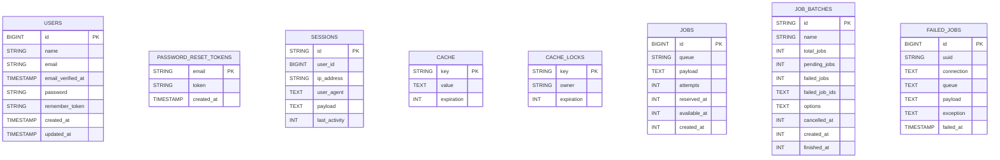
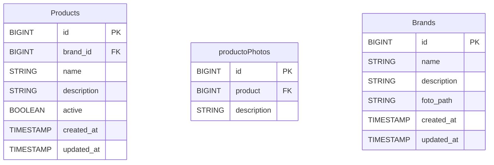

## Diagrama de Base de Datos
### Autenticación

```mermaid
erDiagram
    USERS {
        BIGINT id PK
        STRING name
        STRING email
        TIMESTAMP email_verified_at
        STRING password
        STRING remember_token
        TIMESTAMP created_at
        TIMESTAMP updated_at
    }
    PASSWORD_RESET_TOKENS {
        STRING email PK
        STRING token
        TIMESTAMP created_at
    }
    SESSIONS {
        STRING id PK
        BIGINT user_id
        STRING ip_address
        TEXT user_agent
        TEXT payload
        INT last_activity
    }
    CACHE {
        STRING key PK
        TEXT value
        INT expiration
    }
    CACHE_LOCKS {
        STRING key PK
        STRING owner
        INT expiration
    }
    JOBS {
        BIGINT id PK
        STRING queue
        TEXT payload
        INT attempts
        INT reserved_at
        INT available_at
        INT created_at
    }
    JOB_BATCHES {
        STRING id PK
        STRING name
        INT total_jobs
        INT pending_jobs
        INT failed_jobs
        TEXT failed_job_ids
        TEXT options
        INT cancelled_at
        INT created_at
        INT finished_at
    }
    FAILED_JOBS {
        BIGINT id PK
        STRING uuid
        TEXT connection
        TEXT queue
        TEXT payload
        TEXT exception
        TIMESTAMP failed_at
    }

```

```mermaid
erDiagram
    Products {
        BIGINT id PK
        BIGINT brand_id FK
        STRING name
        STRING description
        BOOLEAN active
        TIMESTAMP created_at
        TIMESTAMP updated_at
    }
    
    productoPhotos {
        BIGINT id PK
        BIGINT product FK
        STRING description
    }

    Brands {
        BIGINT id PK
        STRING name
        STRING description
        STRING foto_path
        TIMESTAMP created_at
        TIMESTAMP updated_at
    }
```
